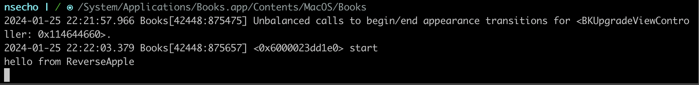

# inject_aarch64

Simply clone the directory and run `make` which will create `inject_arm64` and `inject_arm64e` respectively.

Below is a simple usage on the Books application.

First step is creating the library.

```bash
$ cat lib.c
#include <stdio.h>

__attribute__((constructor))
static void ctor(void)
{
    printf("hello from ReverseApple\n");
}
$ gcc lib.c -dynamiclib -o lib.dylib -arch arm64e
$ # copy to this location to respect the sandbox
$ cp lib.dylib ~/Library/Logs/AirTraffic/airtraffic.log
$ sudo ./inject_arm64e 42448 ~/Library/Logs/AirTraffic/airtraffic.log
```


